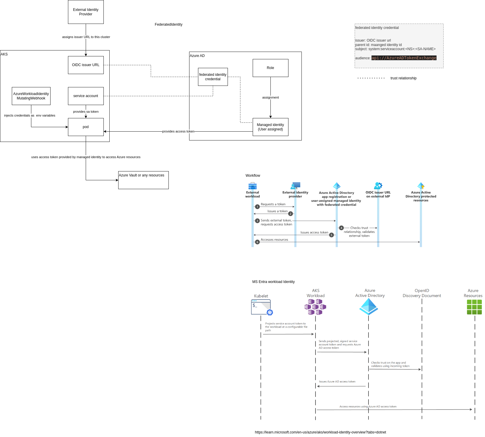

* For an OIDC issuer to cooperates with Microsoft Entra, to authorize access to Microsoft resources.  

* https://learn.microsoft.com/en-us/azure/aks/use-oidc-issuer on Cluster 

  
* OpenID Connector extends OAuth 2.0 authorization 
* OIDC enables SSO between OAuth-enabled applications 

 
* When enabling OIDC issuer on Kubernetes 
  * One OIDC issuer URL associates with this cluster 
  * Has OIDC discovery endpoint running at .well-known/openid-configuration 

  * This returns  
    * Issuer address 
    * jwks_uri  
  * Install Azure WI https://azure.github.io/azure-workload-identity/charts

 

* MS Entra ID can discover API server's public signing key.  
  * The signing key is rotated daily 
  * What does this sign? 

 
* Microsoft Entra ID is Microsoft AWS IAM equinivalent solution  

* References: 

  * Application library: https://learn.microsoft.com/en-us/azure/aks/workload-identity-overview?tabs=python
  * Azure best practice: https://learn.microsoft.com/en-us/azure/aks/operator-best-practices-identity
  * List of services supporting managed identity: https://learn.microsoft.com/en-us/entra/identity/managed-identities-azure-resources/managed-identities-status

* Design diagram

